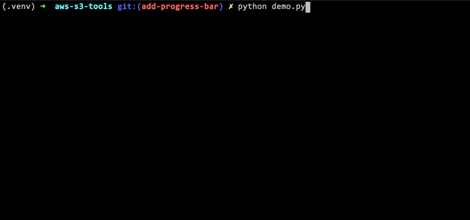

# AWS S3 Tools


[](https://github.com/dlite-tools/aws-s3-tools/actions/workflows/test.yml)
[](https://codecov.io/gh/dlite-tools/aws-s3-tools)


AWS S3 Tools is a Python package to make it easier to interact with S3 objects, where you can:

- List S3 bucket content
- Check if an S3 object exists
- Download/upload S3 objects to/from local files
- Read/write S3 objects into/from Python variables
- Delete/move/copy S3 objects

The AWS S3 authentication is done via boto3 package, via environment variables, aws config file, or parameters.
All S3 objects functions, in this package, have the option to set AWS Session authentication by passing the following dictionary on the `aws_auth` parameter, with the schema below (not all field are required).
To understand more about AWS authentication mechanism, [read boto3 documentation](https://boto3.amazonaws.com/v1/documentation/api/latest/guide/credentials.html).

```python
aws_auth = {
    'region_name': 'REGION',
    'aws_access_key_id': 'ACCESS_KEY',
    'aws_secret_access_key': 'SECRET_KEY',
    'aws_session_token': 'SESSION_TOKEN',
    'profile_name': 'PROFILE_NAME'
}
```

---

## Installation

You can install AWS S3 Tools from PyPi with `pip` or your favorite package manager:

```shell
pip install aws-s3-tools
```

Add the ``-U`` switch to update to the current version, if AWS S3 Tools is already installed.

If you want to use the **progress bar** feature when downloading or uploading,
you need to install an extra dependency.

```shell
pip install aws-s3-tools[progress]
```

---

## Usage

[The full documentation can be found here](https://aws-s3-tools.readthedocs.io/en/latest/index.html).

```python
from s3_tools import object_exists

if object_exists("my-bucket", "s3-prefix/object.data"):
    # Your code goes here
else:
    print("Object not found")
```

Example to use the progress bar:

```python
from s3_tools import upload_folder_to_prefix

result = upload_folder_to_prefix(
    bucket='dlite-tools',
    prefix='aws-s3-tools',
    search_str='*.py',
    threads=2,
    folder='s3_tools',
    show_progress=True
)
```

Progress bar when running the code above:



---

## Contributions

All contributions, bug reports, bug fixes, documentation improvements,
enhancements and ideas are welcome.

A detailed overview on how to contribute can be found in the
[contributing guide](CONTRIBUTING.md)
on GitHub.

---

## Issues

Go [here](https://github.com/dlite-tools/aws-s3-tools/issues) to submit feature
requests or bugfixes.

---

## License and Credits

`AWS S3 Tools` is licensed under the [MIT license](LICENSE) and is written and
maintained by:

- Daniel Ferrari ([@FerrariDG](https://github.com/FerrariDG))
- Carlos Alves ([@cmalves](https://github.com/cmalves))
- Tomás Osório ([@tomassosorio](https://github.com/tomassosorio/))

---

## Acknowledgement

The idea from these functions come from an amazing team that I worked with. This repo is a refactor and documentation to make this public to everyone.

Many thanks to:

- [Anabela Nogueira](https://www.linkedin.com/in/abnogueira/)
- [Carlos Alves](https://www.linkedin.com/in/carlosmalves/)
- [João Machado](https://www.linkedin.com/in/machadojpf/)
- [Renato Dantas](https://www.linkedin.com/in/renatomoura/)
- [Ricardo Garcia](https://www.linkedin.com/in/ricardo-g-oliveira/)
- [Tomás Osório](https://www.linkedin.com/in/tomas-osorio/)
